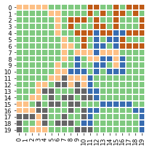
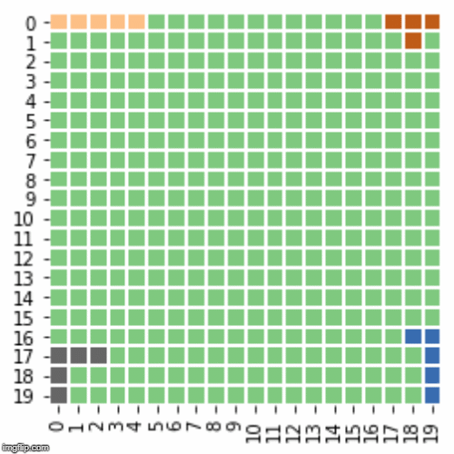

# Blokus-Reinforcement-Learning

This project aims to create an efficient implementation of the game Blokus for eventual use as a reinforcement learning task. So far, the logic of the game has been implemented, and a few basic heuristics have been implemented. An example of gameplay is shown below. Heuristic agents (blue and red) perform fairly comparably but handily defeat random agents (yellow and grey).

This repository is my fun free-time project, so progress will be slow, but here's what I intend to eventually implement:

Heuristics:
- Human selection
- Random
- Space-filling heuristic
- Reinforcement-learning based state estimation

Search Strategies:
- Greedy
- Minimax with alpha-beta pruning
- Monte Carlo search tree

Additional features:
- Interactive gameplay using OpenCV for board plotting
- Live scoreboard and pieces played windows
- "Gym" type environment where different agents (Heuristic + search strategy) can play against one another and long-term statistics are recorded
